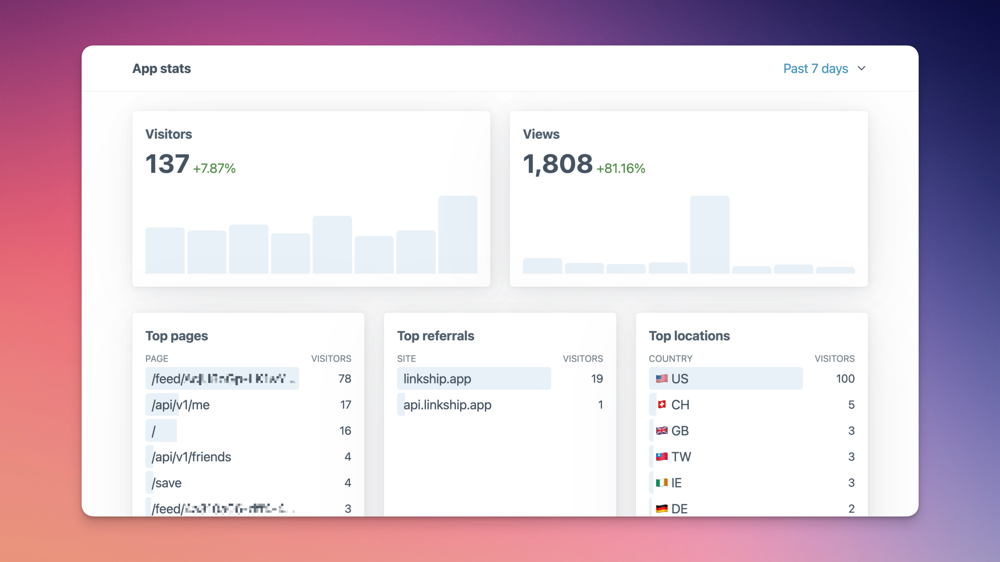

# Kero 📊

Kero is a privacy-friendly, embeddable, analytics dashboard for your Go websites. With its drop-in integrations, it's the easiest way to get an overview of the key web metrics.



* **Privacy-friendly**: Kero tracks server-side requests with limited access to identifiable user data, compared to client-side solutions.
* **Embedded**: Import Kero middleware and you're ready to go, there are no additional databases or servers to provision and maintain.
* **Easy to understand**: Kero comes with a glanceable dashboard that contains all the data you care about on a single page.

## Getting started

To get started with minimal Kero configuration you can simply mount its tracker middleware and dashboard route before initializing your routes in your web server.

Start by fetching the library and adding it to your `go.mod`:

```
go get github.com/josip/kero
```

> [!NOTE]
> This will add indirect dependencies to web frameworks you're not necessarily using as well as many other dependencies pulled in by Prometheus. These will not be included in the built binary.

Within your application you'll have to import both the main Kero library as well as middleware specific to your web framework. Currently Gin and Fiber are supported.

```golang
package main

import (
    "os"
    "github.com/gin-gonic/gin"
    "github.com/josip/kero"
    keromw "github.com/josip/kero/keroginmw"
)
```

Start by creating a new Kero instance:

```go
k, _ := kero.New(
    kero.WithDBPath("./kero"),
    kero.WithDashboardPath("/_kero"),
)
defer k.Close()
```

`DBPath` is where the data will be persisted, with the folder automatically created if it doesn't exist yet. `DashboardPath` is the URL from which the web dashboard will be available.

As the last step, attach the Kero middleware to your web server:

```golang
keromw.Mount(r, k, gin.Accounts{
    os.Getenv("KERO_ADMIN_USER"): os.Getenv("KERO_ADMIN_PASS")
})
```

`Mount` adds the required tracking middleware and exposes the `DashboardPath` route.
Access to the dashboard itself is protected with HTTP Basic Auth using Gin's built-in middleware.

After starting your web server you can now access the dashboard at `/_kero`.

<details>
<summary><b>Full Gin example</b></summary>

```golang
package main

import (
    "os"

    "github.com/gin-gonic/gin"

    "github.com/josip/kero"
    keromw "github.com/josip/kero/keroginmw"
)

func Main() {
    r := gin.New()
    k, _ := kero.New(
        kero.WithDBPath("./kero-stats"),
        kero.WithDashboardPath("/_kero"),
        kero.WithRequestMeasurements(true),
        kero.WithWebAssetsIgnored(true),
        kero.WithBotsIgnored(true),
        kero.WithPixelPath("/track.gif")
    )
    defer k.Close()

    keromw.Mount(r, k, gin.Accounts{
        os.Getenv("KERO_ADMIN_USER"): os.Getenv("KERO_ADMIN_PW"),
    })


    r.GET("/hello", func(ctx *gin.Context) {
        ctx.String(200, "Hello")
    })

    r.Run()
}
```
</details>

<details>
<summary><b>Full Fiber example</b></summary>

```golang
package main

import (
    "os"

    "github.com/gofiber/fiber/v2"
    "github.com/gofiber/fiber/v2/middleware/basicauth"

    "github.com/josip/kero"
    keromw "github.com/josip/kero/kerofibermw"
)

func Main() {
    app := fiber.New()
    k, _ := kero.New(
        kero.WithDBPath("./kero-stats"),
        kero.WithDashboardPath("/_kero"),
        kero.WithRequestMeasurements(true),
        kero.WithWebAssetsIgnored(true),
        kero.WithBotsIgnored(true),
        kero.WithPixelPath("/track.gif")
    )
    defer k.Close()

    keromw.Mount(app, k, basicauth.Config{
        Users: {
            os.Getenv("KERO_ADMIN_USER"): os.Getenv("KERO_ADMIN_PW"),
        },
    })

    app.Get("/hello", func(ctx *fiber.Ctx) error {
        return ctx.SendString("Hello")
    })

    app.Listen(":8080")
}
```
</details>

Want to see support for other HTTP frameworks? [Create a ticket](https://github.com/josip/kero/issues/new) or submit a PR :octocat:.

## Configuration

When creating a new Kero instance you can configure and toggle a number of features:

* `WithDBPath(string)`: path to the database, required
* `WithRetention(time.Duration)`: for how long should be the data stored. Defaults to 15 days
* `WithDashboardPath(string)`: path to the dashboard URL. Defaults to `/_kero`.
* `WithPixelPath(string)`: path to the pixel tracker. Response is always a 1x1px GIF. If empty, the tracker is disabled. Empty by default.
* `WithGeoIPDB(string)`: path to the [GeoLite2](https://dev.maxmind.com/geoip/geolite2-free-geolocation-data) database (`.mmdb` file) used for reverse geocoding of IP addresses. If empty, geocoding is disabled. Empty by default.
* `WithRequestMeasurements(bool)`: controls if request duration should be tracked to provide "Slowest routes". `false` by default. 
* `WithWebAssetsIgnored(bool)`: controls if requests to .css/.js/etc. files should be ignored see godoc for full list. `false` by default.
* `WithBotsIgnored(bool)`: controls if requests from know bots and http libraries should be ignored. `false` by defaults.
* `WithDntIgnored(bool)`: controls if the value of [DNT](https://en.wikipedia.org/wiki/Do_Not_Track) header should be respected or not. `false` by default. 

Recommended configuration:

```golang
kero.New(
    kero.WithDBPath("./kero"),
    kero.WithDashboardPath("/_kero"),
    kero.WithPixelPath("/visit.gif"),
    kero.WithGeoIPDB("./GeoLite2-City.mmdb"),
    kero.WithRequestMeasurements(true),
    kero.WithWebAssetsIgnored(true),
    kero.WithDntIgnored(true),
)
```

## Tracked visitor data

Availability and accuracy of the data collected varies and should be considered as best-effort since browsers themselves and user-installed extensions can introduce noisy data.

* Browser name and its version
* OS name and its version
* Device name
* Device form factor (phone, tablet, desktop, bot)
* Referrer (based on the HTTP header) and [UTM](https://en.wikipedia.org/wiki/UTM_parameters) query parameters
* Country, region and city based on user's IP address (disabled by default)
* Visitor ID (see below)

IP addresses and full `User-Agent` strings are nor stored nor logged in any manner by Kero.

## How are visitors counted?

Each visitor is assigned a hashed ID that encodes their IP address, `Accept-Encoding`, `Accept-Language` and `User-Agent` HTTP headers.

These values are not guaranteed to be unique even between consecutive visits of the same user so they provide an approximative but indicative data, while staying privacy-friendly as much as possible.

Value of the DNT header might be ignored.

## Tracked request metadata

* Request duration, if enabled
* Route (ie. `/user/:id` vs `/user/kero`; not tracked with Fiber)
* Distinction whether request was made by a web browser or programatically via different HTTP client libraries

## Data storage

Kero is using [TSDB](https://github.com/prometheus/prometheus/tree/main/tsdb) from Prometheus to store the data on the disk.

## Who's using Kero

* [Linkship](https://linkship.app)
